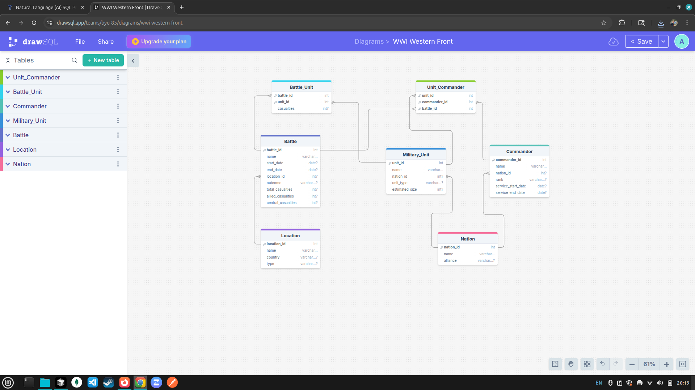

A python script to query a MySQL database for historical WWI information. Features an AI query generating tool that allows you to ask natural language questions about the database

## Schema: 

## Example Questions and Responses: 

**Q: Which nation won the most battles?**  
A: The United Kingdom has won the most battles.

**Q: What was the bloodiest battle of the war?**  
A: The bloodiest battle was the Hundred Days Offensive.

**Q: Which nations were part of each alliance?**  
A:  
Sure! During World War I, the main alliances were:

- **Entente**: United Kingdom, France, Russia, Italy, United States, Canada, Belgium  
- **Central Powers**: Germany, Austro-Hungary, Ottoman Empire

**Q: What battles did the Ottoman Empire participate in?**  
A: The Ottoman Empire participated in many battles, including the famous Gallipoli Campaign.

**Q: Who was the commander in charge the longest?**  
A: Ferdinand Foch.

**Q: Which nation suffered the most casualties?**  
A: The United Kingdom suffered the most casualties, with 1,337,000.

To improve response quality, I put this as the root prompt: 

`You are a world-class data analyst. 
Given the following question, respond ONLY with a valid SQLite SELECT statement that answers it. 
Do not include explanations, comments, or any text outside the SQL. 
If the question cannot be answered, return a syntactically valid SELECT that would fail gracefully. 
If you are unsure, make your best guess based on the schema. `
